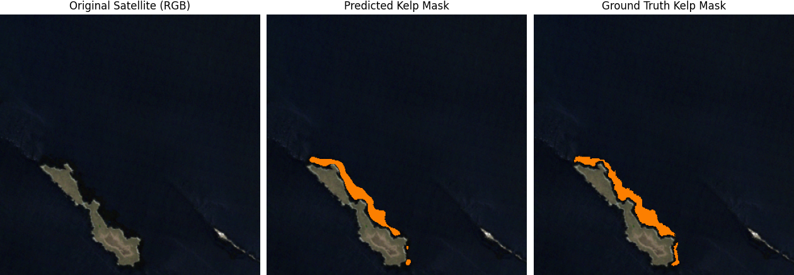

# Automated Kelp Canopy Mapping: A UNet Approach with Landsat & Citizen Science



> This study developed and evaluated an end-to-end deep learning pipeline, utilizing a UNet architecture with pre-trained ResNet backbones, for semantic segmentation of kelp canopy in Landsat 7 imagery using Floating Forests labels, incorporating rigorous data preprocessing and augmentation. We found that a ResNet34 backbone, trained on cleaned and augmented data, achieved an Intersection over Union (IoU) of 0.5028, with data preprocessing and augmentation proving essential for optimal performance. Our study suggests that deep learning, leveraged with citizen-science-derived ground truth, offers a viable and scalable approach to automate kelp canopy mapping, which can enhance the efficiency of conservation efforts by reallocating resources towards direct ecological interventions.

## Table of Contents
- [Overview](#overview)
- [Key Features](#key-features)
- [How to Use the Tool (Inference)](#how-to-use-the-tool-inference)
- [How to Reproduce Our Results (Training & Evaluation)](#how-to-reproduce-our-results-training--evaluation)
- [Requirements (Suggested)](#requirements-suggested)
- [Contributing (Suggested)](#contributing-suggested)
- [License (Suggested)](#license-suggested)

## Overview
This project presents a deep learning pipeline for the automated mapping of kelp canopy from Landsat 7 satellite imagery. It leverages a UNet architecture with ResNet backbones and citizen science data (Floating Forests labels) for training and evaluation. The primary goal is to provide a scalable solution for monitoring kelp ecosystems, aiding conservation efforts.

## Key Features
- **UNet Architecture:** Utilizes a robust UNet model for semantic segmentation.
- **ResNet Backbones:** Supports pre-trained ResNet backbones (e.g., ResNet34) for feature extraction.
- **Landsat 7 Imagery:** Specifically designed for processing Landsat 7 satellite data.
- **Citizen Science Integration:** Incorporates Floating Forests labels for ground truth.
- **Data Preprocessing & Augmentation:** Includes steps for data cleaning and augmentation to improve model performance.
- **End-to-End Pipeline:** Covers data preparation, model training, inference, and evaluation.

## How to Use the Tool (Inference)
Follow these steps to use the pre-trained model to generate kelp canopy masks on new Landsat 7 imagery:

1.  **Obtain Landsat 7 Images:**
    *   Acquire the Landsat 7 images you wish to process.
    *   Images must be in the shape `(350, 350, 7)`.
    *   The required band ordering is:
        *   `0`: Short-wave infrared (SWIR)
        *   `1`: Near infrared (NIR)
        *   `2`: Red
        *   `3`: Green
        *   `4`: Blue
        *   `5`: Cloud Mask (binary - 0 for no cloud, 1 for cloud)
        *   `6`: Digital Elevation Model (DEM - meters above sea-level)
    *   If Cloud Mask and DEM bands are unavailable, they can be substituted with layers of zeros of the same spatial dimensions.
    *   Store these `.tif` images in the `data/cleaned/train_satellite/` directory.
        *   *For a quick test, you can use `data_copy.py` to copy some sample training data to this directory.*

2.  **Clean Data (Optional but Recommended):**
    *   The raw Landsat 7 data can be noisy. We provide an automated cleaning script.
    *   Navigate to the data cleaning directory and run the script:
        ```bash
        cd data_cleaning/
        python data_clean.py
        ```
        *(You might need to adjust paths within `data_clean.py` if your input data for cleaning is not in the default expected location.)*

3.  **Run Inference:**
    *   **Download the Pre-trained Model:**
        *   Download the `34_clean_aug` model folder from: [Google Drive Link](https://drive.google.com/drive/folders/1TlhEzbolgPp9DIkzbnAVSdZWoLRjPctm?usp=sharing)
    *   **Place Model Files:**
        *   Store the downloaded `34_clean_aug` folder (containing `best_weights.pth` and `optimal_threshold.txt`) into the `runs/` directory at the root of this project. Your structure should look like `runs/34_clean_aug/best_weights.pth`.
    *   **Generate Masks:**
        *   Navigate to the models directory and run the `generate_masks.py` script. This script will load the model weights and process the images in `data/cleaned/train_satellite/`.
        *   Adjust the `SATELLITE_INPUT_DIR_STR` and `ORIGINAL_RUN_DIR_FOR_WEIGHTS` constants at the top of `generate_masks.py` if your paths differ.
        ```bash
        cd models/  # Or cd ../models if you were in data_cleaning
        python generate_masks.py
        ```
        *   Predicted masks will be saved to the `output/generated_masks/INFERENCE_RUN_NAME/` directory (where `INFERENCE_RUN_NAME` is set in `generate_masks.py`).

4.  **View Results:**
    *   To visualize the generated masks alongside their corresponding RGB satellite images:
    *   Navigate to the data visualization directory and run the `output_view.py` script.
    *   Ensure the `INFERENCE_RUN_NAME` constant at the top of `output_view.py` matches the one used in `generate_masks.py`.
        ```bash
        cd ../data_visualization/ # Or appropriate path from models/
        python output_view.py
        ```

## How to Reproduce Our Results (Training & Evaluation)
Follow these steps to replicate the training process and evaluation results presented in our study:

1.  **Download Data:**
    *   Download the full dataset (including training and ground truth labels) from: [Google Drive Link](https://drive.google.com/drive/folders/12OTsSu9QpEbhQWyeh9ZKtMVTI74oBX-K?usp=sharing)
    *   This dataset contains satellite images and their corresponding kelp masks.

2.  **Organize Data:**
    *   Create a `cleaned` directory inside your `data` folder if it doesn't exist.
    *   Save the downloaded satellite images into `data/cleaned/train_satellite1/`.
    *   Save the downloaded kelp masks into `data/cleaned/train_kelp1/`.
       

3.  **Clean Data:**
    *   The satellite images in `data/cleaned/train_satellite1/` need to be processed by the cleaning script.
    *   Navigate to the data cleaning directory:
        ```bash
        cd data_cleaning/ # Adjust path as needed
        python data_clean.py
        ```
        *(Important: You may need to adjust the input/output directory paths within `data_clean.py` to point to `train_satellite1` and save its cleaned output, e.g., to `data/cleaned/train_satellite/` which the split script might expect.)*

4.  **Split Data:**
    *   The cleaned data needs to be split into training, validation, and testing sets.
    *   Navigate to the utils directory:
        ```bash
        cd ../utils/ # Adjust path as needed
        python split_data.py
        ```
        *(Ensure `split_data.py` is configured to read from the output directory of your cleaning step and write to the standard `train_satellite`, `train_kelp`, `val_satellite`, `val_kelp`, `test_satellite`, `test_kelp` subdirectories within `data/cleaned/`.)*

5.  **Train Model:**
    *   Navigate to the models directory (e.g., `cd ../models/`).
    *   Open `350resnet.py` (or the relevant training script, e.g., `train.py`).
    *   Adjust training parameters (e.g., `BACKBONE`, `MAX_EPOCHS`, `RUN_NAME`, `DATA_DIR`) at the top of the script as needed. For reproducing the ResNet34 result, ensure `BACKBONE = "resnet34"`.
    *   Run the training script:
        ```bash
        python 350resnet.py 
        ```
    *   Once training is complete, all relevant information, including model weights and logs, will be stored in a subdirectory within the `runs/` directory, named according to `RUN_NAME`.

6.  **Testing & Evaluation:**
    *   **Find Optimal Threshold:**
        *   Navigate to the models directory (if not already there).
        *   Open `find_threshold.py`. Adjust the parameters at the top (e.g., `RUN_NAME`, `DATA_DIR_STR`, `BACKBONE_NAME`) to match the details of your completed training run stored in the `runs/` directory.
        *   Run the script:
            ```bash
            python find_threshold.py
            ```
            This will save an `optimal_threshold.txt` file in your specific run directory within `runs/`.
    *   **Run Test Set Evaluation:**
        *   Open `test.py`. Adjust parameters at the top (e.g., `RUN_NAME`, `BACKBONE_NAME`, `DATA_DIR_STR`) to point to your completed training run and its weights. The script will automatically try to load the `optimal_threshold.txt`.
        *   Run the script:
            ```bash
            python test.py
            ```
            Predicted masks for the test set will be saved to the `output/RUN_NAME/` directory, and evaluation metrics will be printed and saved to `runs/RUN_NAME/results.txt`.
    *   **View Outputted Masks (Comparison):**
        *   Navigate to the data visualization directory (e.g., `cd ../data_visualization/`).
        *   Open `data_compare.py`. Adjust `OUTPUT_RUN` at the top to match the `RUN_NAME` of your test evaluation.
        *   Run the script:
            ```bash
            python data_compare.py
            ```
            This will display a random sample comparing the original satellite image, the model's prediction, and the ground truth mask.

## Requirements
*   Python 3.8+
*   PyTorch
*   PyTorch Lightning
*   Torchvision
*   TorchMetrics
*   NumPy
*   Pandas
*   Matplotlib
*   Seaborn
*   Tifffile
*   TQDM
*   Albumentations (if used for augmentation in training)
